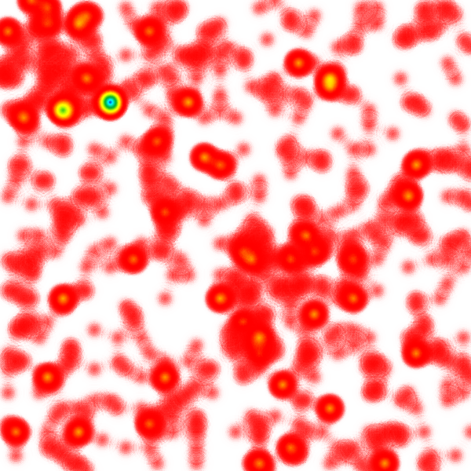

# python-heat
___
`python-heat` is a simple heatmap generator

## Examples

See [example.py](./example.py) for details.

```python
get_heatmap_image(
    points,
    data_bounds=bounds,
    size=size,
    scheme='classic',
    dotsize=30,
    pointgrid_size=1,
).save('example_1.png')
```

___

```python
get_heatmap_image(
    points,
    data_bounds=bounds,
    size=size,
    scheme='classic',
    dotsize=60,
    pointgrid_size=10,
).save('example_2.png')
```

___

```python
get_heatmap_image(
    points,
    data_bounds=bounds,
    size=size,
    scheme='classic',
    dotsize=80,
    pointgrid_size=50,
).save('example_3.png')
```

___

```python
get_heatmap_image(
    points,
    data_bounds=bounds,
    size=size,
    scheme='fire',
    dotsize=100,
    pointgrid_size=6,
).save('example_4.png')
```
